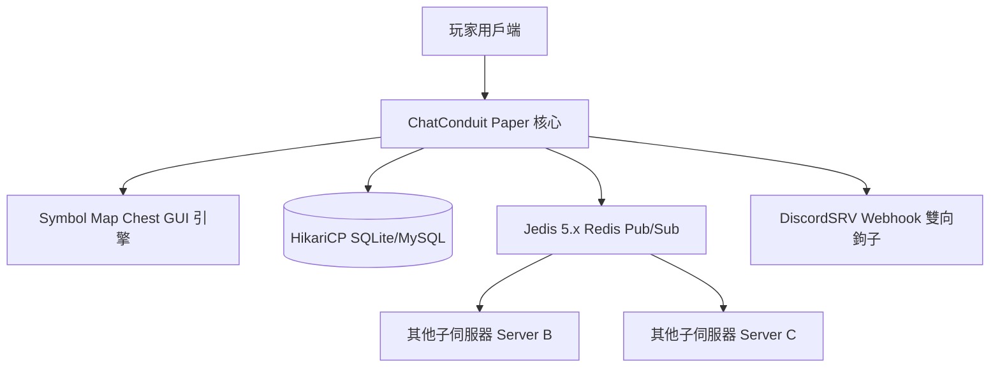

**ChatConduit** 是一款專為大型跨服群服 (BungeeCord / Velocity) 與單服深度的 Minecraft 伺服器設計的新一代社交與聊天頻道管理插件。

---

## 核心設計哲學

1. **零指令發言 (Zero-Command Messaging)**:
   傳統插件需要玩家記住 `/g`, `/l`, `/trade` 等複雜指令。ChatConduit 引進**前綴符號自動過濾路由**，玩家只需輸入 `!大家好` 即可發言至全服頻道，極大降低玩家學習成本。

2. **UI 與邏輯完全解耦 (Chest GUI Symbol Layout Architecture)**:
   選單不再採用硬編碼 Slot 槽位。管理員可在 `gui/*.yml` 中透過字符陣列（如 `layout: ['#########', '#FFFFFFF#']`）任意佈局，按鈕圖示與點擊事件綁定至對應 Symbol 符號。

3. **非同步 0 阻塞主執行緒 (Async-First Architecture)**:
   所有 SQL 存取 (HikariCP 連線池)、Redis Pub/Sub 跨服廣播與資料庫快取載入，皆透過 CompletableFuture 與 Bukkit Async Scheduler 進行，徹底打消資料庫延遲導致的伺服器卡頓 (TPS Drop)。

---

## 模組架構圖 (System Architecture)

